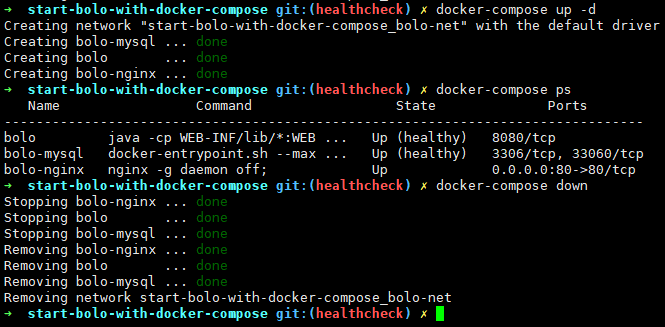

<p align = "center">

<br><br>
使用 docker-compose 一键启动 bolo 博客
<br>


<br>


<!--  -->
<!--  -->
<!--  -->
</p>

# 简介

本项目专注于使用 docker-compsoe 进行容器的编排，实现 bolo 博客的一键启动，以避免广大人民群众在进行 bolo 部署时走不必要的弯路；降低了使用门槛，同时也大大增加了维护与迁移的便利性，同时也增加了容器的健康检查机制。

**注意：本项目使用 nginx 的反向代理作为 bolo 的 web 服务器、目前支持一键式的http部署（默认占用了80端口）、如若需要启用https访问支持，请自行进行配置。**

## 快速开始

### 新特性：容器健康状态检查

此容器健康检查机制是基于 `docker-compose.yaml` 的，最新的 `docker-compose.yaml` 也经过了调整，重新更改为环境变量的方式，如果你更喜欢使用变量文件可以在 [releases](https://github.com/expoli/start-bolo-with-docker-compose/releases) 界面下载 `v1.0` 版本。

**注意：同时因为这只是修改了 `docker-compose.yaml` 原容器的构建方式并没有改变，所以原方式依旧有效！**

- 新特性运行结果



### 服务器部署

默认 bolo 的访问域名为 localhost，如果您想直接在本地在本地试用，并通过 localhost 进行访问、那么无需修改任何文件、直接参考 [本地快速部署测试](#本地快速部署测试)，即可。

在进行服务器部署时，请根据需要修改 `bolo-env.env` **强烈建议将数据库密码修改为强密码！同时别忘对所有密码项进行同步更改！** 修改完成后根据 [本地快速部署测试](#本地快速部署测试)，进行后续步骤即可。

```
# mysql env
# 建议使用强密码
MYSQL_ROOT_PASSWORD=new_root_password
MYSQL_USER=solo
MYSQL_DATABASE=solo
MYSQL_PASSWORD=solo123456

# bolo env
# 请同步更新为上方MYSQL密码
RUNTIME_DB=MYSQL
JDBC_USERNAME=solo
JDBC_PASSWORD=solo123456
JDBC_DRIVER=com.mysql.cj.jdbc.Driver
JDBC_URL=jdbc:mysql://mysql:3306/solo?useUnicode=yes&characterEncoding=UTF-8&useSSL=false&allowPublicKeyRetrieval=true&serverTimezone=UTC

#
# 需要修改为你的博客域名
#
SERVER_HOST=localhost

# 你一般不需要修改
SERVER_PORT=
SERVER_SCHEME=http
LISTEN_PORT=8080

```

**启动参数说明：**

- `--listen_port` ：进程监听端口
- `--server_scheme` ：最终访问协议，如果反代服务启用了 HTTPS 这里也需要改为 https
- `--server_host` ：最终访问域名或公网 IP，不要带端口
- `--server_port` ：最终访问端口，使用浏览器默认的 80 或者 443 的话值留空即可

详情请参考：[Solo 用户指南](https://hacpai.com/article/1492881378588)

### 启用HTTPS

**注意：启用HTTPS时需先备好证书文件，并将公私钥文件，重命名至 `nginx/ssl/bolo.key` 与 `nginx/ssl/bolo.pem` 覆盖默认示例文件。**

<details>
<summary>启用HTTPS</summary>

1. 修改 `nginx/conf.d/bolo.conf` 取消相关注释

```conf
    ###### HTTPS #######
    listen 443 ssl http2

    # HTTP_TO_HTTPS_START
    # HTTP 强制跳转至 HTTPS
    # if ($server_port !~ 443){
    #      rewrite ^(/.*)$ https://$host$1 permanent;
    # }
    #HTTP_TO_HTTPS_END

    ssl_certificate         /var/www/ssl/bolo.pem;
    ssl_certificate_key     /var/www/ssl/bolo.key;
    ssl_protocols TLSv1 TLSv1.1 TLSv1.2 TLSv1.3;
    ssl_ciphers ALL:!aNULL:!EXPORT56:RC4+RSA:+HIGH:+MEDIUM:+LOW:+SSLv2:+EXP;
    ssl_early_data on;
    ssl_prefer_server_ciphers on;
    ssl_session_cache shared:SSL:10m;
    ssl_session_timeout 10m;
    error_page 497  https://$host$request_uri;
    ###### HTTPS #######
```

2. 修改 `docker-compose.yaml` 取消注释，监听 443 端口

```yaml
services:
  nginx:
    image: nginx:latest
    restart: always
    container_name: "bolo-nginx"
    ports:
      - "80:80"
      - "443:443"
```

3. 修改 `bolo-env.env` 

```
SERVER_PORT=
# HTTP 修改为HTTPS
SERVER_SCHEME=https
LISTEN_PORT=8080
```

4. **根据 本地快速部署 重新启动 bolo**
</details>

### 本地快速部署

如果你只想体验一下 bolo ，那么可以根据下面的命令提示进行 bolo 的快速部署。

- **克隆本项目至本地**

```shell
git clone https://github.com/expoli/start-bolo-with-docker-compose.git
```

- **进入至项目根路径**

```shell
cd start-bolo-with-docker-compose
```

- **加载修改后的环境变量**

```shell
export $(cat ./bolo-env.env )
```

- **使用 docker-compose 启动 bolo**

```shell
# 后台启动
export $(cat ./bolo-env.env ) && docker-compose up -d

# 前台方式启动可以看到日志输出、方便进行排错
export $(cat ./bolo-env.env ) && docker-compose up
```

- **更新容器**

```shell
export $(cat ./bolo-env.env ) && docker-compose pull && docker-compose up -d
```

- **删除容器与 docker 网络（但保留mysql数据库）**

```shell
export $(cat ./bolo-env.env ) && docker-compose down
```

- **完全删除**

如果你想完全卸载 bolo 只需要删除本项目文件夹即可、**因为mysql数据库文件挂载至了本项目的mysql自文件夹**，这种方式也防止因不熟悉docker-compse导致了数据的丢失。

```shell
sudo rm start-bolo-with-docker-compose -rf
```

### 启用定时更新

<details>
<summary>定时更新</summary>

可使用 Linux 的定时任务实现定时更新。具体实现方式如下：

1. 手动运行定时命令进行测试

```bash
cd /path/to/your/docker-compose && export $(cat ./bolo-env.env ) && docker-compose pull && docker-compose down && docker-compose up -d
```

2. 确认运行无误之后将其添加至定时任务中

编辑 `/var/spool/cron/你的用户名` 文件，将下面这一行添加至文件中即可。（每周五的凌晨2点钟进行更新）时间间隔可随意设置、写法可参考 https://crontab.guru/

```shell
0  2  *  *  5  cd /path/to/your/docker-compose && export $(cat ./bolo-env.env ) && docker-compose pull && docker-compose down && docker-compose up -d
```
</details>

### 访问测试

<details>
<summary>点击查看访问测试</summary>

再确认已经启动完成之后、使用浏览器访问您设置的对应域名即可完成博客的初始化。

- bolo 初始化界面


- bolo 初始化完成界面

</details>

## 详细介绍

<details>
<summary>点击查看项目介绍</summary>

### 文件结构

```shell
.
├── bolo-env.env
├── docker-compose.yaml
├── image
├── LICENSE
├── mysql # mysql 数据库
│   └── data
├── nginx
│   ├── conf.d/bolo.conf # nginx 子配置文件目录、可添加自定义配置文件（以.conf结尾）
│   |── nginx.conf
│   └── ssl
│       ├── bolo.key
│       └── bolo.pem
├── README.md
├── theme # 主题文件存放路径、如需挂载自定义主题、请在 docker-compose.yaml 中做好相应配置
│   └── solo-nexmoe
└── web
    └── markdowns # markdown 文件存放路径（使用markdown 文件初始化时bolo使用）详情参考 solo 导入markdown文件
```

### docker-compose.yaml

<details>
<summary>点击查看docker-compose.yaml</summary>

```yaml
version: "2.4"

services:
  nginx:
    image: nginx:latest
    restart: always
    container_name: "bolo-nginx"
    ports:
      - "80:80"
      # - "443:443"
    depends_on:
      bolo:
        condition: service_started
    links: 
      - "bolo:bolo"
    volumes:
      - ./nginx/conf.d:/etc/nginx/conf.d:ro
      - ./nginx/nginx.conf:/etc/nginx/nginx.conf:ro
      # HTTPS 证书挂载配置
      - ./nginx/ssl:/var/www/ssl:ro
    networks:
      - bolo-net

  mysql:
    image: mysql:5
    restart: always
    container_name: "bolo-mysql"
    expose:
      - "3306"
    volumes:
      - ./mysql/data:/var/lib/mysql
    env_file:
      - bolo-env.env
    healthcheck:
      test: "mysql --user=root --password=${MYSQL_ROOT_PASSWORD} --execute 'SHOW DATABASES;'" 
      interval: 2s
      timeout: 20s
      retries: 10
    networks:
      - bolo-net
    command: --max_allowed_packet=32505856 --character-set-server=utf8mb4 --collation-server=utf8mb4_general_ci

  bolo:
    image: tangcuyu/bolo-solo:latest
    restart: always
    container_name: "bolo"
    expose:
      - "8080"
    depends_on:
      mysql:
        condition: service_healthy
    links:
      - "mysql:mysql"
    # 主题与文章挂载目录
    # volumes: 
    #   - ./web/markdowns:/opt/solo/markdowns:rw
    #   - ./theme/solo-nexmoe:/opt/solo/skins/nexmoe
    env_file:
      - bolo-env.env
    healthcheck:
      test: "nc -z localhost 8080 || exit 1"
      interval: 10s
      timeout: 20s
      retries: 10
    networks:
      - bolo-net
    command: --listen_port=${LISTEN_PORT} --server_scheme=${SERVER_SCHEME} --server_host=${SERVER_HOST} --server_port=${SERVER_PORT}

networks: 
  bolo-net:
```

</details>


</details>
